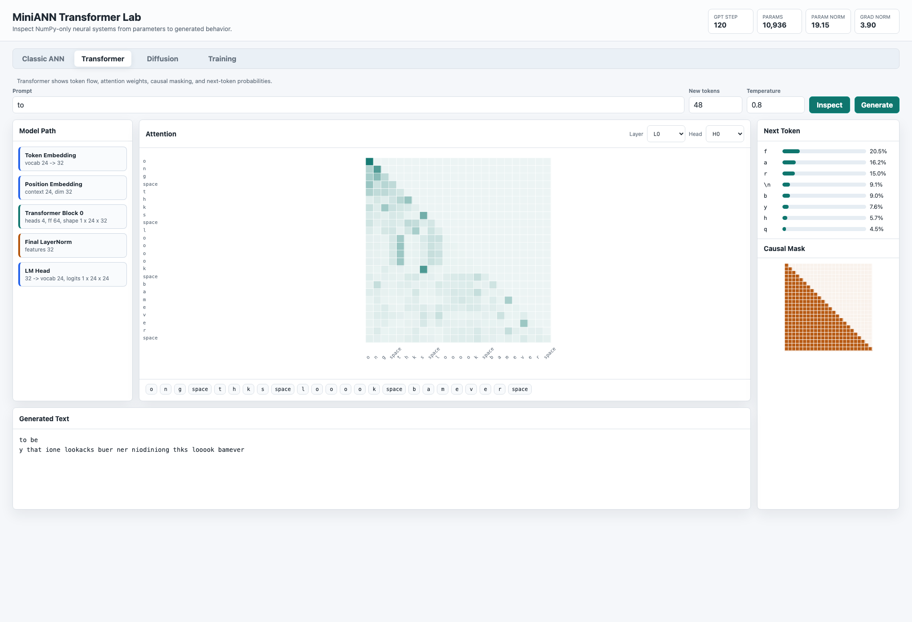
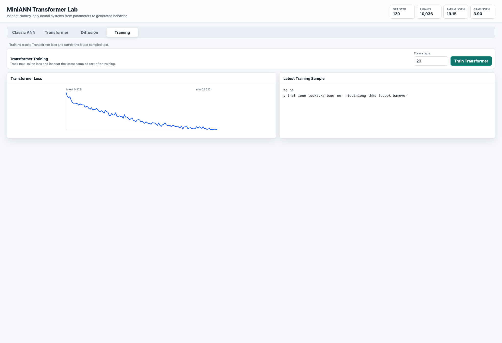

# MiniANN-Transformer

MiniANN-Transformer is a minimal decoder-only Transformer written for research and education. It uses Python and NumPy only, with explicit `forward` and `backward` methods instead of autograd.

This is not intended to replace PyTorch, TensorFlow, or JAX. The point is to make the path from ANN primitives to a tiny GPT-style language model readable.

## What Is Implemented

- ANN basics: `Linear`, ReLU, GELU, stable softmax, cross entropy, SGD, Adam
- Transformer pieces: token embeddings, positional embeddings, LayerNorm, causal masking, scaled dot-product attention, multi-head self-attention, feed-forward networks, residual blocks
- Tiny GPT model: embeddings, decoder blocks, final LayerNorm, and a language-model head
- Toy character-level training loop
- Autoregressive generation with temperature sampling
- Debug outputs: tensor shapes, causal mask, attention matrices, token probabilities hook points, and parameter count

## ANN Components To Transformer

A Transformer block is built from ordinary neural-network parts:

- `Linear` layers project embeddings into queries, keys, values, feed-forward hidden states, and vocabulary logits.
- GELU adds nonlinearity inside the feed-forward network.
- Softmax turns attention scores and output logits into probability distributions.
- LayerNorm stabilizes activations before attention and feed-forward sublayers.
- Residual connections preserve information and improve gradient flow.

The browser lab makes these pieces inspectable from the parameter level up to generated behavior.


## Mathematical Foundations

### Classic ANN

The XOR demo is a small multilayer perceptron:

```text
h_1 = tanh(x W_1 + b_1)
h_2 = tanh(h_1 W_2 + b_2)
y_hat = sigmoid(h_2 W_3 + b_3)
L = mean((y_hat - y)^2)
```

It is intentionally low-dimensional, so the learned decision boundary can be plotted directly over the input plane.

### Decoder-Only Transformer

For token ids `x_1, ..., x_T`, the model first forms token and position embeddings:

```text
X = E_token[x] + E_pos[0:T]
```

Each attention head computes scaled dot-product attention:

```text
Q = X W_Q
K = X W_K
V = X W_V
A = softmax((Q K^T / sqrt(d_head)) + M)
H = A V
```

`M` is a causal mask with `-inf` above the diagonal, so position `t` can only attend to positions `<= t`. Multi-head attention concatenates heads, applies an output projection, then a feed-forward network:

```text
FFN(x) = GELU(x W_1 + b_1) W_2 + b_2
```

Residual paths and LayerNorm give the block:

```text
X' = X + MHA(LayerNorm(X))
Y  = X' + FFN(LayerNorm(X'))
```

The language-model head produces next-token logits. Training minimizes cross entropy:

```text
L = -mean(log softmax(logits_t)[x_{t+1}])
```



### Toy Diffusion

The diffusion demo uses a fixed forward noising process and a learned denoiser. For clean image `x_0`, noise `epsilon ~ N(0, I)`, and schedule `alpha_bar_t`, the forward process is:

```text
x_t = sqrt(alpha_bar_t) x_0 + sqrt(1 - alpha_bar_t) epsilon
```

The denoiser is trained to predict the injected noise:

```text
L = E[||epsilon - epsilon_theta(x_t, t)||_2^2]
```

Sampling starts from Gaussian noise and iteratively applies the learned reverse process.


### Optimization

All gradients are computed by explicit module `backward` methods rather than autograd. The training loops use SGD or Adam-style updates over NumPy arrays:

```text
theta <- theta - eta * update(gradient_theta L)
```

The lab exposes loss curves, parameter norms, gradient norms, attention matrices, masks, and sampled text so that numerical training dynamics can be inspected alongside model behavior.



## Why Decoder-Only

Decoder-only models predict the next token from previous tokens. That makes them ideal for a tiny educational GPT-style implementation: the training target is just the input shifted by one position, and causal masking prevents the model from seeing future tokens.

## How Attention Works

Scaled dot-product attention computes:

```text
scores = QK^T / sqrt(head_dim)
weights = softmax(mask(scores))
output = weights V
```

The causal mask keeps each position from attending to tokens on its right. Multi-head attention repeats this process in several smaller representation spaces, then concatenates the heads and applies a final linear projection.

## Train The Tiny Model

Run the toy demo:

```bash
python examples/tiny_gpt_demo.py
```

Or run the module directly:

```bash
python -m miniann_transformer.train
```

The demo trains on a tiny character-level corpus, prints loss, and then samples text.

## Generate Text

Use `generate` with a trained model and tokenizer:

```python
from miniann_transformer.generate import generate

text = generate(model, tokenizer, prompt="to ", max_new_tokens=80, temperature=0.8)
print(text)
```

Use `temperature=0.0` for greedy decoding.

## Debug And Visualization

Call:

```python
logits, debug = model.forward(token_ids, return_debug=True)
```

`debug` contains layer output shapes, the causal mask, per-layer attention matrices, token probabilities, and parameter count.

## Tests

Run:

```bash
python -m unittest discover tests
```

## Limitations

- This code prioritizes clarity over speed.
- Backpropagation is manual and only covers the modules included here.
- There is no batching pipeline beyond the toy helper.
- No GPU, mixed precision, dropout, checkpointing, or advanced sampling.
- The demo corpus is intentionally tiny, so generated text is for mechanics, not quality.
